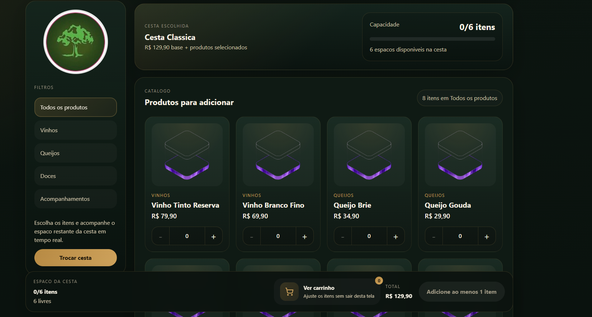

# Monte Sua Cesta

Projeto desenvolvido para permitir a montagem personalizada de cestas, facilitando a seleção de itens e a organização do pedido.

## Objetivo
O sistema foi criado com o objetivo de oferecer uma forma prática de montar uma cesta personalizada, permitindo ao usuário escolher os produtos de forma simples e organizada.

## Funcionalidades
- Seleção de produtos para a cesta
- Organização dos itens escolhidos
- Interface intuitiva para montagem
- Visualização da composição da cesta

## Tecnologias utilizadas
- HTML
- CSS
- JavaScript

## Como executar
1. Baixe ou clone este repositório
2. Abra a pasta do projeto
3. Execute o arquivo principal no navegador

## Imagens do projeto

## Autor
Vitor Knierin